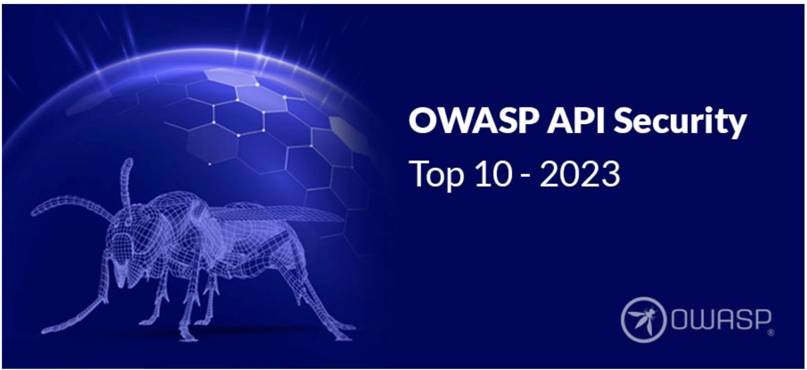
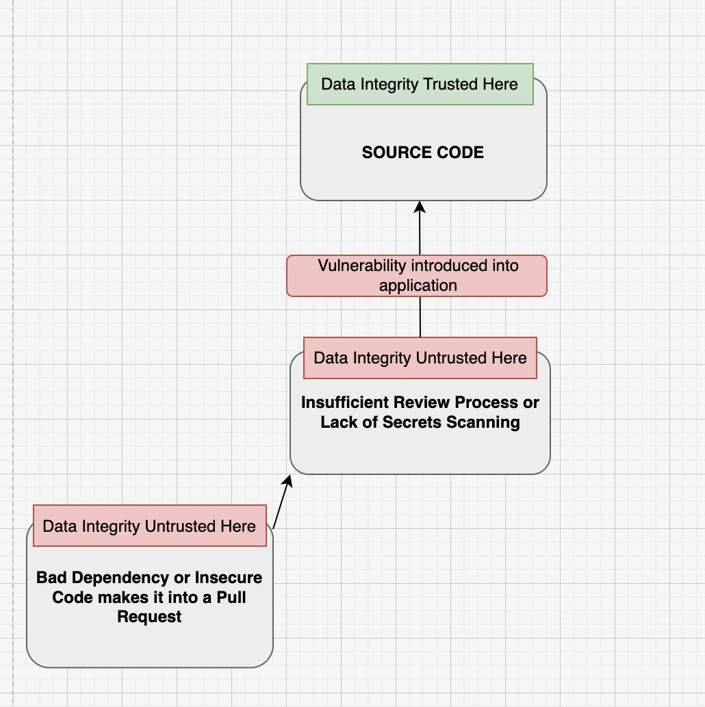

# Software and Data Integrity Failures


### Number 8 in OWASP's Top Ten most critical security risks to applications


- OWASP: Open Worldwide Application Security Project. It is a non-profit organization that aims to improve software security through education, tools, and collaboration.

- OWASP Top Ten: A standard awareness document for developers and web application security. It represents a broad consensus about the most critical security risks to web applications.
------------------------------------

### Often happens when your data is compromised either by unexpected behavior in the handling of data via third party dependencies or by some overlooked problem in your code.  Also presents itelf often when there is no robust review process in the CI/CD pipeline.



## A Spooky Example &#128123;


### Enabling bad actors to morph packages, performing malicious atttacks by running any command they want when their package is installed:

Running:
``` bash 
npm install malicious-package
```

Gives you:

<span style="color: #b6290b;">Whoops: All your tokens vanished! </span>

This is a real-life example of what happened to the `eslint-scope` package, where npm tokens were harvested by bad actors through usage of run-scripts.


## Ways to Protect Against:

- Know the package before using it
- Disable run scripts on install with some flag (npm has `ignore-scripts`)